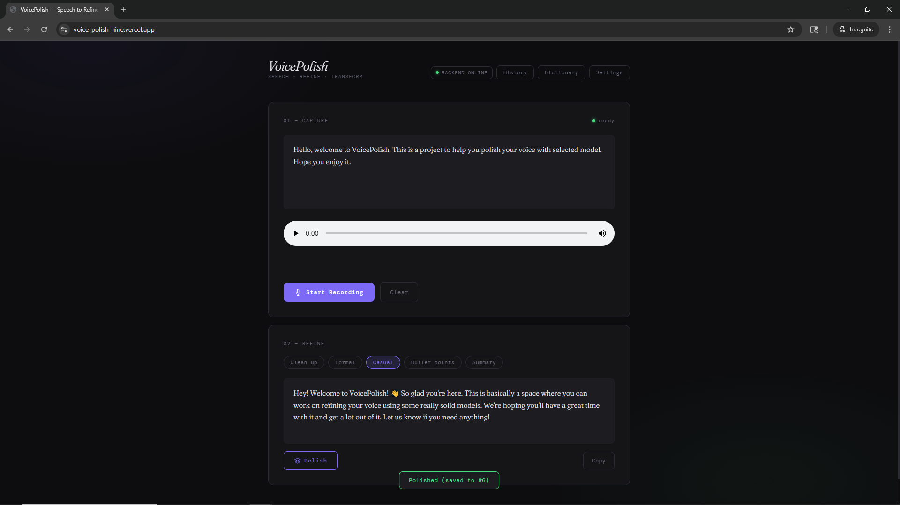
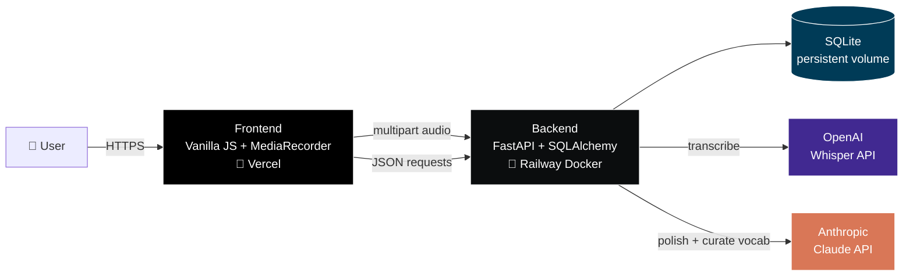
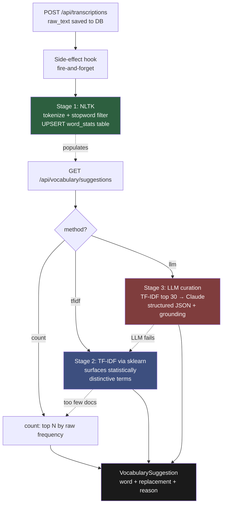

# VoicePolish

> Speech-to-text with AI refinement and adaptive vocabulary learning.


Capture your voice, convert it to polished text via OpenAI Whisper + Claude.
Over time, VoicePolish learns the domain-specific terms you use most and
suggests adding them to your personal dictionary using a three-stage pipeline
(NLTK → TF-IDF → LLM).

**🔗 Live demo:** https://voice-polish-nine.vercel.app/
**🔗 Backend API docs:** https://voicepolish-production-4b7c.up.railway.app/docs



---

## Why This Project

Existing voice transcription tools either output raw, unedited text or apply
generic cleanup that misses domain-specific terminology. Users repeatedly
correct the same words across recordings — there's no system that *learns*
their vocabulary. VoicePolish solves this with a three-stage AI pipeline that
becomes more useful the more you use it.

The interesting engineering isn't the transcription itself — it's the
**vocabulary mining pipeline** that combines cheap statistical algorithms
with expensive AI in a standard "candidate generation → ranking" pattern
borrowed from production search and recommender systems.

---

## Architecture

### System overview



The frontend handles audio capture and UI. The backend owns all API keys,
database access, LLM calls, and vocabulary analytics — nothing sensitive
lives in the browser.

### Three-stage vocabulary mining pipeline

The core technical contribution. Each layer adds intelligence on top of the
previous one's output.



Dotted arrows show the **graceful degradation chain**: if the expensive layer
fails (LLM timeout, rate limit, etc.), the system silently falls back to the
previous layer so users always see useful results.

---

## Key Features

- **Whisper-based transcription** — multipart audio upload to OpenAI Whisper API, replacing browser-native SpeechRecognition for cross-browser consistency
- **5 polish modes** powered by Claude — clean, formal, casual, bullets, summary
- **Adaptive vocabulary mining** — three-stage pipeline (see architecture above)
- **Custom dictionary** — applied pre-polish so the LLM sees your intended terms
- **Graceful degradation** — LLM failure → TF-IDF fallback → count fallback
- **Production-ready** — Dockerized backend on Railway with persistent SQLite volume, env-driven CORS hardening

---

## Tech Stack

| Layer | Technology |
|-------|-----------|
| Backend framework | FastAPI + Uvicorn |
| ORM / DB | SQLAlchemy + SQLite |
| Transcription | OpenAI Whisper API (multipart upload) |
| Polish / curation | Anthropic Claude (Haiku 4.5) |
| NLP | NLTK (tokenization, stopwords) |
| ML | scikit-learn (TF-IDF) |
| Frontend | Vanilla HTML/CSS/JS, MediaRecorder API |
| Deployment | Docker, Railway (backend), Vercel (frontend) |

---

## Engineering Highlights

- **Two-stage candidate generation** for vocabulary suggestions (cheap algorithm → expensive AI), a standard production ML pattern from search/recsys
- **Grounding constraint** on LLM outputs — only accepts terms that exist in the TF-IDF candidate pool, preventing hallucinated suggestions
- **Layered architecture** — routes → schemas → services → models, allowing service-layer reuse
- **Defensive JSON parsing** for LLM responses (handles markdown fence wrapping despite explicit prompt instructions)
- **Graceful degradation chain** across LLM → TF-IDF → count fallback levels
- **Side-effect hook pattern** for word frequency tracking — analytics failures never block the primary save flow
- **Immutable Docker images** for reproducible production deployments
- **Runtime debug endpoint** added during deployment to inspect Railway volume mounting when CLI shell access wasn't available

---

## Local Development

Two paths: a one-command Docker Compose stack (recommended) and a bare
uvicorn setup for fast iteration on backend code without rebuilding images.

### Prerequisites
- **For the Docker path**: Docker Desktop
- **For the bare path**: Python 3.12+, OpenAI API key, Anthropic API key
- Modern browser (Chrome/Edge/Firefox)

### Path A — Docker Compose (recommended, mirrors production)

One command starts the whole stack — multi-stage Dockerized FastAPI backend
behind an nginx reverse proxy that also serves the static frontend. Mirrors
the production topology (Vercel + Railway) on a single local host.

```powershell
# 1. Copy .env.example to .env and add your API keys
copy backend\.env.example backend\.env
notepad backend\.env   # add OPENAI_API_KEY and ANTHROPIC_API_KEY

# 2. Start the stack (first run builds the backend image; subsequent runs reuse it)
docker compose up
```

Then open **http://localhost:8080** in your browser.

Useful commands:
```powershell
docker compose up -d        # start detached
docker compose logs -f      # follow logs from all services
docker compose down         # stop (keeps SQLite data)
docker compose down -v      # stop and wipe SQLite data
docker compose build        # force rebuild after Dockerfile changes
```

The SQLite database lives in a named volume (`voicepolish_data`) mounted at
`/data/voicepolish.db` inside the container — same path Railway uses in
production, so the local stack exercises the same code path.

**Note on `depends_on`:** Compose starts the backend container before nginx,
but doesn't wait for FastAPI to finish booting. On the first request after
`up`, you may see a brief 502 from nginx if the backend is still loading
NLTK data. Refresh after a few seconds.

### Path B — Bare uvicorn (faster iteration on backend code)

Skip Docker for tight inner loops where you're editing backend code and want
`--reload` behavior without rebuilding images.

```powershell
cd backend
python -m venv venv
.\venv\Scripts\Activate.ps1
pip install -r requirements.txt
python -c "import nltk; nltk.download('punkt_tab'); nltk.download('stopwords')"

copy .env.example .env
notepad .env           # add OPENAI_API_KEY and ANTHROPIC_API_KEY

uvicorn app.main:app --reload
```

API at **http://localhost:8000** · Docs at **http://localhost:8000/docs**

For the frontend in this mode, you also need a separate static server **and**
you need to switch `API_BASE` in `frontend/VoicePolish.html` back to the
explicit `http://localhost:8000` (see the comment at the `const API_BASE`
declaration).

```powershell
cd frontend
python -m http.server 5500
```

Then visit http://localhost:5500/VoicePolish.html

---

## Deployment

Backend deployed on **Railway** via auto-build from Dockerfile. Required env vars:
- `OPENAI_API_KEY`
- `ANTHROPIC_API_KEY`
- `ALLOWED_ORIGINS` (comma-separated; e.g. `https://your-frontend.vercel.app`)
- `DATABASE_URL` (e.g. `sqlite:////data/voicepolish.db` for Railway volume)

Set `Root Directory = backend` in the Railway service settings so it finds the
Dockerfile.

Frontend deployed on **Vercel** with `Root Directory = frontend`. The
`API_BASE` is environment-aware, automatically switching between
`localhost:8000` (development) and the Railway URL (production) based on
`location.hostname`.

---

## Roadmap

- [x] **M1** — FastAPI skeleton with `/health`
- [x] **M2** — Database schema (transcriptions, vocabulary) + SQLAlchemy ORM
- [x] **M3** — Frontend wired to backend; transcripts saved to DB
- [x] **M4** — Polish logic moved to backend (API keys off the client)
- [x] **M5** — Vocabulary analysis v1: NLTK + frequency counting
- [x] **M6** — Vocabulary analysis v2: TF-IDF via scikit-learn
- [x] **M7** — Vocabulary analysis v3: LLM-assisted curation with grounding
- [x] **M8** — Whisper integration (multipart audio upload, full pipeline)
- [x] **M9.1** — Backend dockerized
- [x] **M9.2** — Backend deployed to Railway (with persistent volume for SQLite)
- [x] **M9.3** — Frontend deployed to Vercel (env-aware API_BASE)
- [x] **M9.4** — Production CORS hardening (env-driven origin whitelist)
- [ ] **M10** — Test coverage (pytest + httpx) + GitHub Actions CI
- [ ] **M11** — PostgreSQL migration for true multi-user support

---

## Known Limitations

- **Whisper hallucination on silence**: Whisper occasionally returns multilingual
  training-data residue (e.g. "Thanks for watching!") on silent input. This is
  a model-level limitation; client-side voice activity detection is documented
  as TODO inline.
- **Single-user**: No authentication; the deployed instance is a shared demo.
  Add OAuth + per-user vocabulary tables for production multi-user use.
- **No automated tests**: Manual end-to-end testing only. M10 will add pytest.

These are conscious trade-offs documented in
[`VoicePolish_Decisions_Log.md`](https://github.com/UBOWENVT/VoicePolish) (in
project notes).

---

## Contributing

Issues and PRs welcome. For larger changes, please open an issue first to
discuss what you'd like to change.

Commit message convention: prefix with milestone identifier (e.g. `M10: ...`)
to maintain a readable git history.

---

## License

MIT — see [LICENSE](LICENSE) for details.
